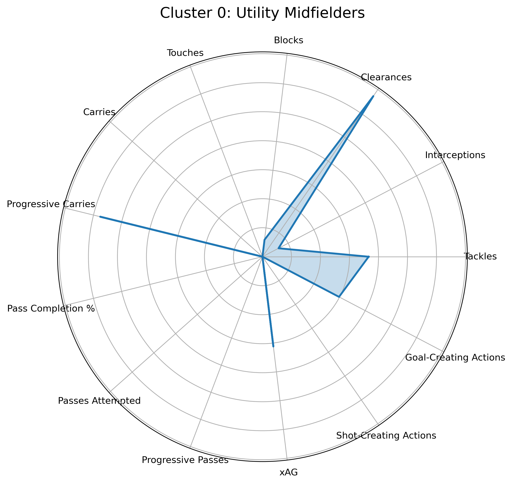
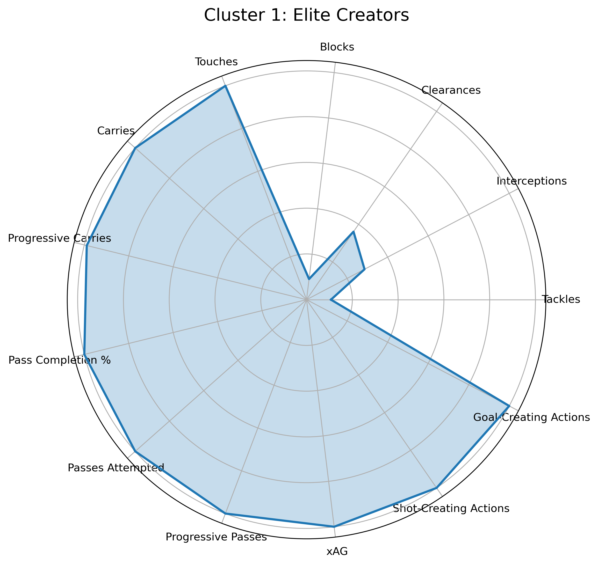
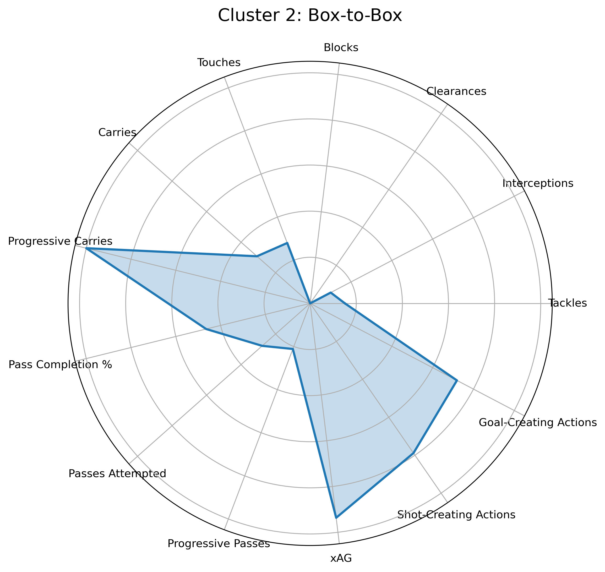

# 🧠 Premier League Midfielder Analysis - Project 1

This project compares five elite Premier League midfielders using real match data to explore both creative and defensive attributes. It's a showcase of data analysis, football intelligence, and visualization in Python.

## ⚽ Players Analyzed
- Bruno Fernandes (Manchester United)
- Kevin De Bruyne (Manchester City)
- Rodri (Manchester City)
- Declan Rice (Arsenal)
- Martin Ødegaard (Arsenal)

---

## 📊 Metrics Compared

### 🎨 Creative Metrics (Radar Chart)
- Expected Assists (xAG)
- Shot-Creating Actions (SCA)
- npxG + xAG
- Progressive Passes
- Progressive Carries
- Touches in Attacking Penalty Area

### 🛡️ Defensive/Physical Metrics (Radar Chart)
- Tackles
- Interceptions
- Aerials Won
- Clearances
- Blocks
- Successful Take-Ons

---

## 📈 Visuals

### Creative Metrics Radar  

### Defensive Metrics Radar  

---

## 💻 Tools Used

- Python (Pandas, Matplotlib, Seaborn)
- Jupyter Notebooks
- Git & GitHub
- Data source: [FBref.com](https://fbref.com/)

---

## 🧠 Key Insights

- **De Bruyne** leads in creativity (xAG, SCA, final-third involvement).
- **Bruno** shows elite creative output with significant shot involvement.
- **Rodri** is a midfield metronome — top for progressive passes and highly defensive.
- **Rice** is balanced — contributes defensively and carries forward.
- **Ødegaard** is a positional, technical operator — high in progressive actions but less involved in duels.

---

## 📂 Folder Structure

midfield-analysis/
├── data/          # Raw data files (player_stats.csv)
├── notebooks/     # Jupyter notebooks (visualizations, analysis)
├── visuals/       # Exported radar charts
└── README.md      # Project summary

---

# 🧠 Clustering Premier League Midfielders by Playing Style - Project 2

This project uses unsupervised machine learning to cluster Premier League midfielders based on their playing style. By analyzing per-90 metrics like tackles, progressive passes, xAG, and more, we uncover 5 distinct midfielder profiles.

---

## 📊 Stats Used for Clustering

- Tackles, Interceptions, Clearances, Blocks  
- Touches, Carries, Progressive Carries  
- Pass Completion %, Passes Attempted, Progressive Passes  
- Expected Assisted Goals (xAG), Shot-Creating Actions (SCA), Goal-Creating Actions (GCA)

All features were normalized and passed through **k-means clustering** and **PCA** to visualize groupings in 2D space.

---

## 🔎 Clusters Identified

### 🟩 Cluster 0: Utility Midfielders
- Modest output across the board
- Often used for structure or tactical flexibility

---

### 🟨 Cluster 1: Elite Creators
- High touches, progressive passes, top xAG and SCA
- Typically central to the team's attacking build-up  

---

### 🟦 Cluster 2: Box-to-Box
- Balanced in defense, progression, and creation
- Active on both sides of the pitch  

---

### 🟥 Cluster 3: Support / Low Volume
- Lower involvement in possession and creation
- Play safer, supportive roles  

---

### 🟫 Cluster 4: Ball-Winners
- High tackles, blocks, interceptions  
- Simple and effective passers, low creative output  

---

## 🛠 Tools & Libraries

- **Python**: pandas, numpy, matplotlib, scikit-learn  
- **Data Source**: [FBref.com](https://fbref.com/en/) – Premier League per-90 stats  
- **Visualization**: Radar charts per cluster, PCA-based scatter plot

---

## 📂 Project Structure

midfield-analysis/ 
├── data/ # All raw stat CSVs (standard, passing, defensive, etc.) 
├── notebooks/ 
│ └── midfielder_clustering.ipynb # Main clustering notebook 
├── visuals/ # Radar charts for each cluster 
  └── README.md # You're here

---

## 🚀 How to Reproduce

1. Clone the repo  
2. Open `midfielder_clustering.ipynb`  
3. Run all cells to see clustering, radar plots, and player lists per group

---

## 🧠 Future Work

- Add player-level radar comparisons  
- Use t-SNE for even smoother cluster separation  
- Expand dataset to top 5 leagues  
- Track seasonal changes (e.g. pre/post-transfer)

---

## 👤 Author

Built by Liam Bugeja  
⚽ Aspiring Football Analyst | 🧪 Data Enthusiast | 💻 Python Developer  
🔗 [GitHub](https://github.com/fbriebdk) | [LinkedIn](https://www.linkedin.com)
