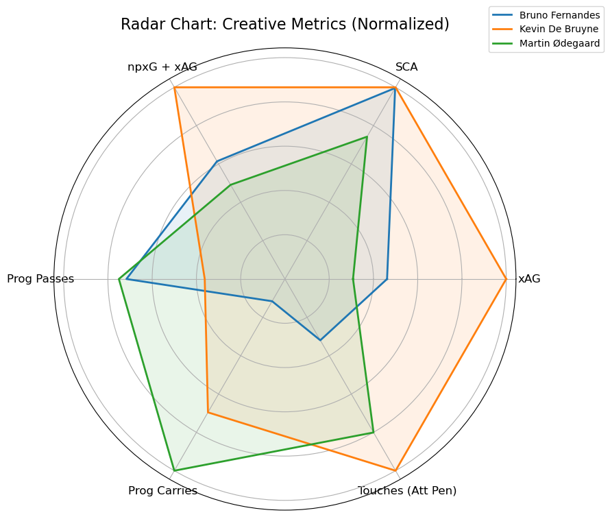
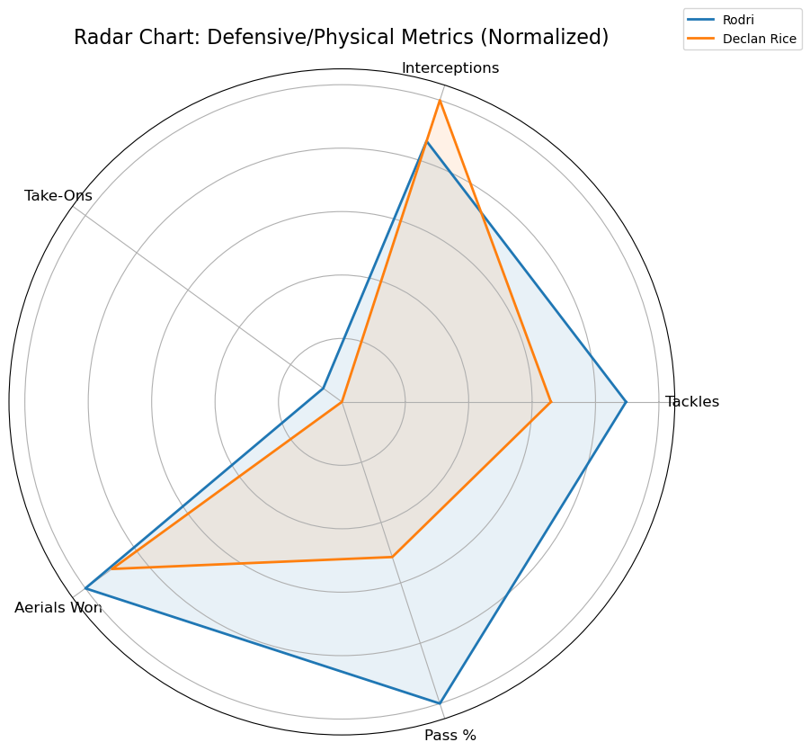

# 🧠 Premier League Midfielder Analysis - Project 1
=======
# 🧠 Premier League Midfielder Analysis – Master Repo

This repo contains football analytics mini-projects built using Python and FBref data.

## 📁 Projects

### 🔹 [Clustering Midfielders by Style](clustering/README.md)
Group Premier League midfielders by playing style using k-means and radar charts.

### 🔹 [Elite Midfielder Stat Comparison](basic_stats_analysis/README.md)
Compare Bruno Fernandes, De Bruyne, Ødegaard, Rodri, and Rice with radar/bar charts.

---

## 📊 Metrics Compared

### 🎨 Creative Metrics (Radar Chart)
- Expected Assists (xAG)
- Shot-Creating Actions (SCA)
- npxG + xAG
- Progressive Passes
- Progressive Carries
- Touches in Attacking Penalty Area

### 🛡️ Defensive/Physical Metrics (Radar Chart)
- Tackles
- Interceptions
- Aerials Won
- Clearances
- Blocks
- Successful Take-Ons

---

## 📈 Visuals

### Creative Metrics Radar  

### Defensive Metrics Radar  

---

## 💻 Tools Used

- Python (Pandas, Matplotlib, Seaborn)
- Jupyter Notebooks
- Git & GitHub
- Data source: [FBref.com](https://fbref.com/)

---

## 🧠 Key Insights

- **De Bruyne** leads in creativity (xAG, SCA, final-third involvement).
- **Bruno** shows elite creative output with significant shot involvement.
- **Rodri** is a midfield metronome — top for progressive passes and highly defensive.
- **Rice** is balanced — contributes defensively and carries forward.
- **Ødegaard** is a positional, technical operator — high in progressive actions but less involved in duels.

---

## 📂 Folder Structure

midfield-analysis/
├── data/          # Raw data files (player_stats.csv)
├── notebooks/     # Jupyter notebooks (visualizations, analysis)
├── visuals/       # Exported radar charts
└── README.md      # Project summary

---