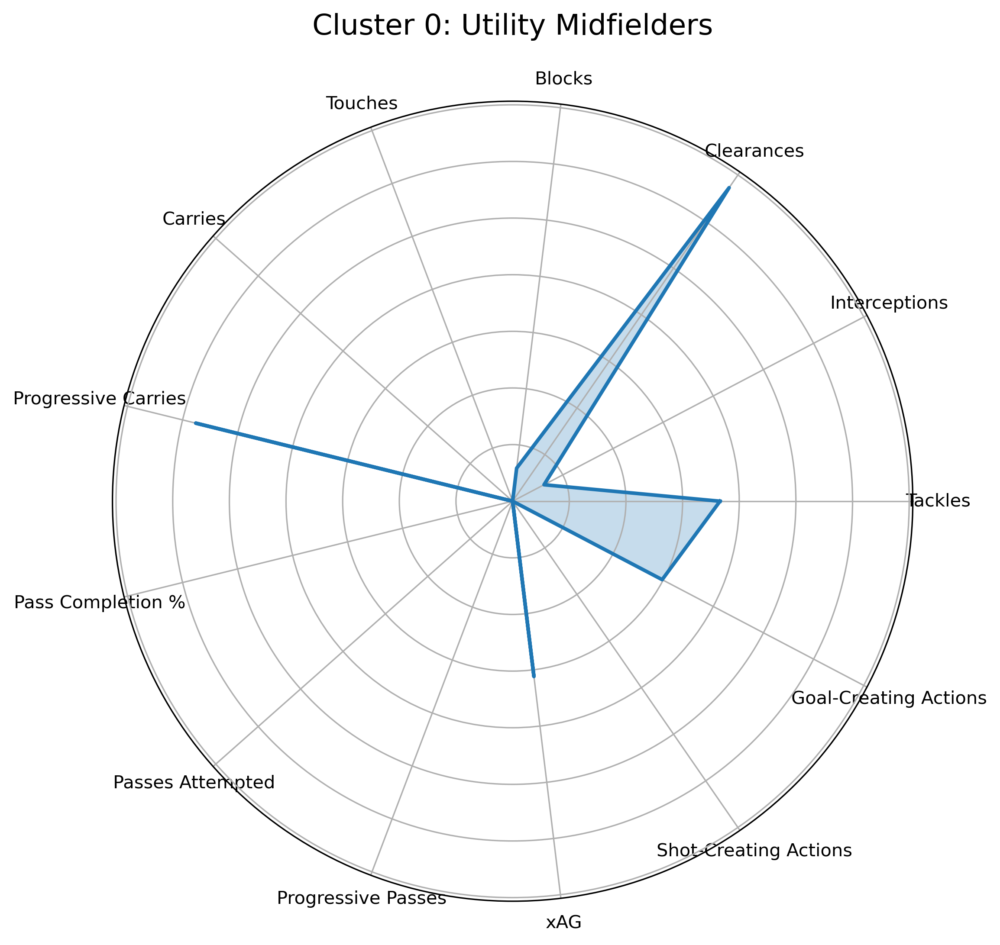
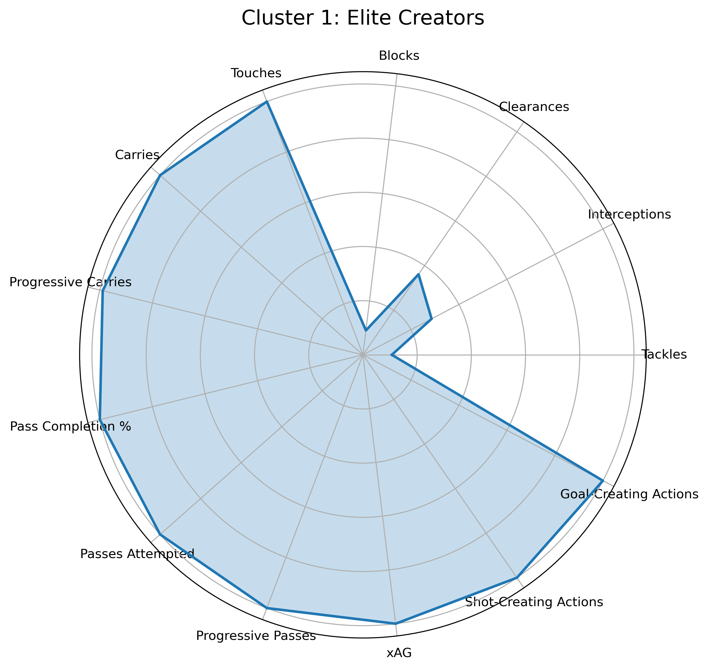
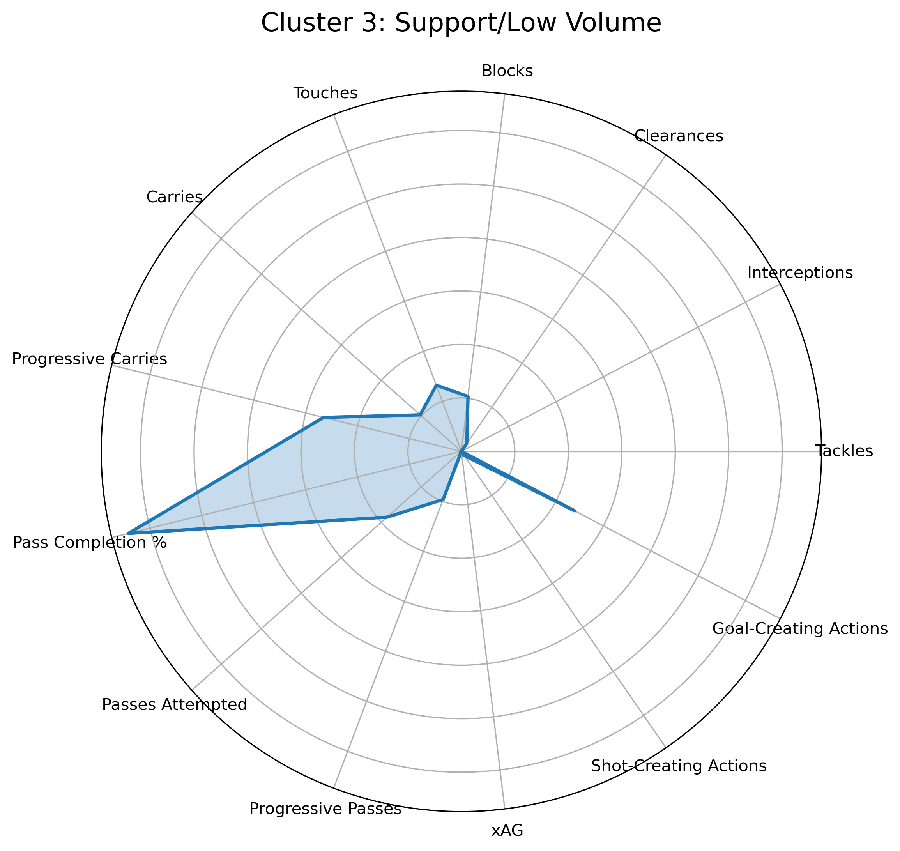
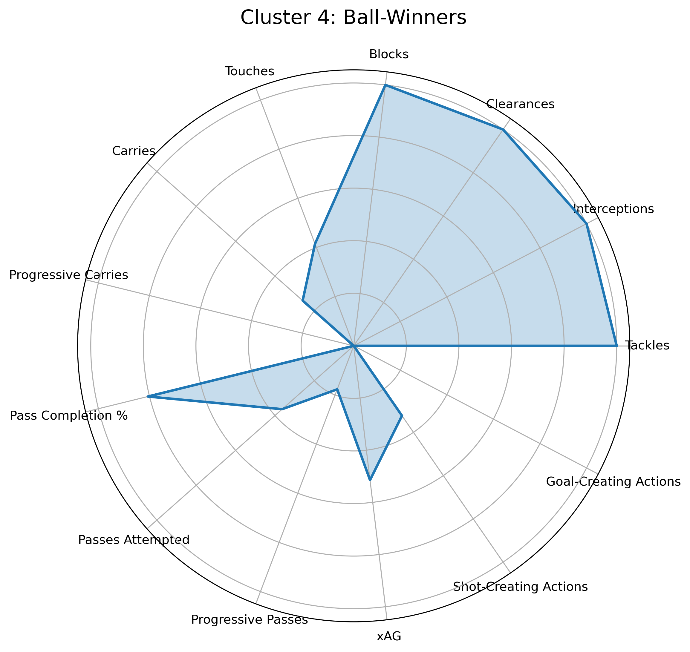

# 🧠 Clustering Premier League Midfielders by Playing Style - Project 2

This project uses unsupervised machine learning to cluster Premier League midfielders based on their playing style. By analyzing per-90 metrics like tackles, progressive passes, xAG, and more, we uncover 5 distinct midfielder profiles.

---

## 📊 Stats Used for Clustering

- Tackles, Interceptions, Clearances, Blocks  
- Touches, Carries, Progressive Carries  
- Pass Completion %, Passes Attempted, Progressive Passes  
- Expected Assisted Goals (xAG), Shot-Creating Actions (SCA), Goal-Creating Actions (GCA)

All features were normalized and passed through **k-means clustering** and **PCA** to visualize groupings in 2D space.

---

## 🔎 Clusters Identified

### 🟩 Cluster 0: Utility Midfielders
- Modest output across the board
- Often used for structure or tactical flexibility

---

### 🟨 Cluster 1: Elite Creators
- High touches, progressive passes, top xAG and SCA
- Typically central to the team's attacking build-up  

---

### 🟦 Cluster 2: Box-to-Box
- Balanced in defense, progression, and creation
- Active on both sides of the pitch  
[Cluster 2](visuals/cluster_2_box-to-box.png)

---

### 🟥 Cluster 3: Support / Low Volume
- Lower involvement in possession and creation
- Play safer, supportive roles  

---

### 🟫 Cluster 4: Ball-Winners
- High tackles, blocks, interceptions  
- Simple and effective passers, low creative output  

---

## 🛠 Tools & Libraries

- **Python**: pandas, numpy, matplotlib, scikit-learn  
- **Data Source**: [FBref.com](https://fbref.com/en/) – Premier League per-90 stats  
- **Visualization**: Radar charts per cluster, PCA-based scatter plot

---

## 📂 Project Structure

midfield-analysis/ 
├── data/ # All raw stat CSVs (standard, passing, defensive, etc.) 
├── notebooks/ 
│ └── midfielder_clustering.ipynb # Main clustering notebook 
├── visuals/ # Radar charts for each cluster 
  └── README.md # You're here

---

## 🚀 How to Reproduce

1. Clone the repo  
2. Open `midfielder_clustering.ipynb`  
3. Run all cells to see clustering, radar plots, and player lists per group

---

## 🧠 Future Work

- Add player-level radar comparisons  
- Use t-SNE for even smoother cluster separation  
- Expand dataset to top 5 leagues  
- Track seasonal changes (e.g. pre/post-transfer)

---