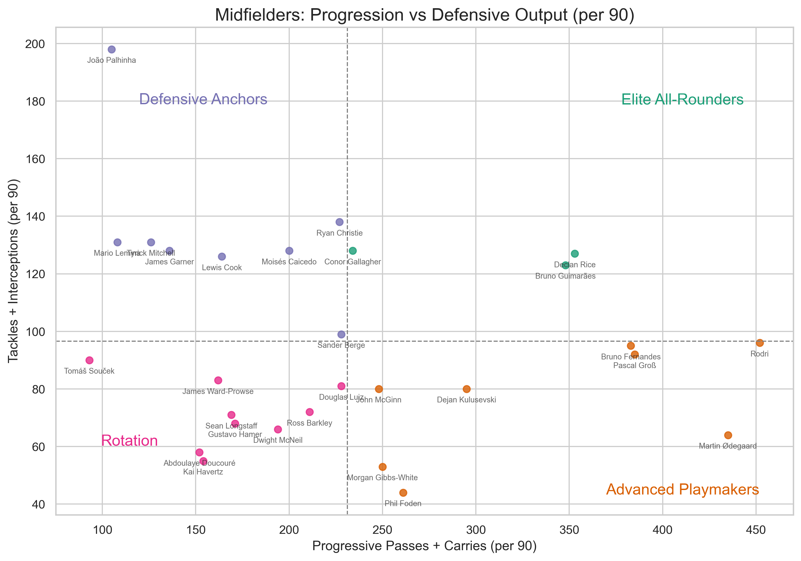

# 🎯 Midfielder Style Map: Progression vs Defensive Output

This project visualizes the stylistic profiles of Premier League midfielders based on their ability to **progress the ball** and contribute **defensively**. It helps identify player roles and tactical fit using a quadrant-based analysis.

---

## 📊 Methodology

Players are plotted using two custom per 90-minute metrics:

- **Progression Score** = Progressive Passes + Progressive Carries
- **Defensive Score** = Tackles + Interceptions

These scores are computed from real match data (per 90) to ensure fairness across different minutes played.

---

## 🧠 Tactical Quadrants

The map is split into four areas using average values on both axes:

| Role                   | Description                                      | Color         |
|------------------------|--------------------------------------------------|---------------|
| Elite All-Rounders     | High progression & high defensive output         | Teal-green    |
| Advanced Playmakers    | High progression, lower defensive output         | Burnt orange  |
| Defensive Anchors      | High defensive output, lower progression         | Muted purple  |
| Rotation               | Lower output in both metrics (rotation / bench)  | Hot pink      |

---

## 📈 Visuals

---

## ⚽ 35 Midfielders Used in this example

"Declan Rice", "Rodri", "Kevin De Bruyne", "Bruno Fernandes",
    "Martin Ødegaard", "Enzo Fernández", "James Maddison",
    "Pascal Groß", "Alexis Mac Allister", "João Palhinha",
    "Kobbie Mainoo", "Douglas Luiz", "Conor Gallagher",
    "Bruno Guimarães", "Tyrick Mitchell", "Morgan Gibbs-White",
    "Phil Foden", "Lewis Cook", "Dejan Kulusevski",
    "Sean Longstaff", "Kai Havertz", "Abdoulaye Doucouré",
    "Ross Barkley", "Moisés Caicedo", "Ryan Christie",
    "Dwight McNeil", "Tomáš Souček", "Sander Berge",
    "Moisés Caicedo", "James Ward-Prowse", "John McGinn",
    "Mario Lemina", "Gustavo Hamer", "James Garner"

---

## 🧰 Tools Used

- **Python**
- `pandas`
- `matplotlib`
- Raw CSVs from [FBref.com](https://fbref.com/)

---

## 📂 Folder Structure

midfielder_style_map/ 
├── notebooks/ 
│ └── style_map.ipynb # Main notebook with analysis and plot 
| └── web_scrapper.ipynb # Used to scrape the datasets from [FBref.com](https://fbref.com/)
| └──create_dataset_from_dataset # Notebook which filtered the original dataset and created a newer dataset called standard_stats_selected_players.csv
├── visuals/ 
│ └── quadrant_map.png # Final scatter plot 
├── data/ 
| └── defensive_stats_selected_players.csv # 35 Midfielders and their defensive_stats
| └── premier_league_per90_2023_2024.csv # Original dataset with over 500 rows including standard_stats of EPL midfielders
| └── standard_stats_selected_players.csv # Derived dataset from the original dataset filtered for those 35 midfielders
└── README.md

---

## 📌 Key Insights

- The quadrant view makes it easy to visually compare midfielders by their style and role.
- Several players show extreme specialization (e.g., high progression but low defending).
- Standout names can be highlighted for scouting, recruitment, or comparison.

---

## 🔮 Future Upgrades

- Build an **interactive Plotly version** with tooltips and search
- Add a **cluster overlay** to group similar player types
- Create a **Streamlit dashboard** for user interaction and filtering

---

> Built with passion for the beautiful game ⚽  
> By [@friebdk](https://github.com/fbriebdk)